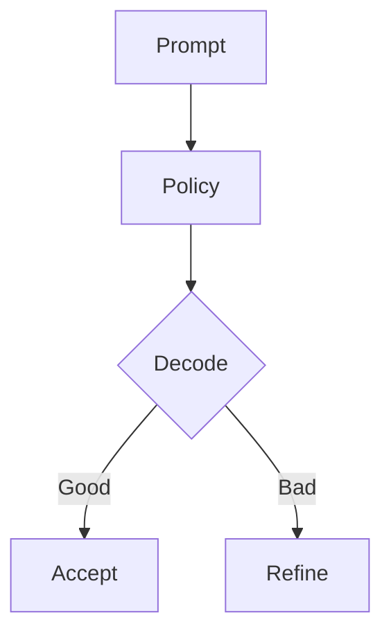

This starter shows math, code, and a diagram.

## Math

We’ll use cross-entropy and KL often:

$$
\mathrm{CE}(p, q) = -\sum_i p_i \log q_i,\quad
\mathrm{KL}(p\,\|\,q)=\sum_i p_i \log \frac{p_i}{q_i}.
$$

## Code

```python
import numpy as np

def softmax(x):
    e = np.exp(x - x.max())
    return e / e.sum()

print(softmax(np.array([1.0, 2.0, 3.0])))
```

## Mermaid


