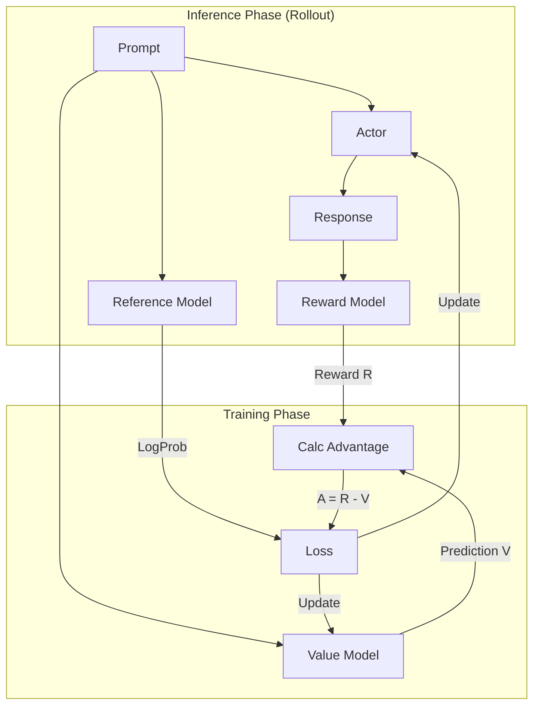
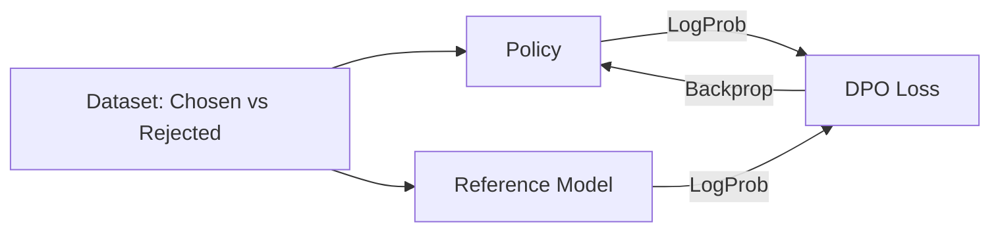
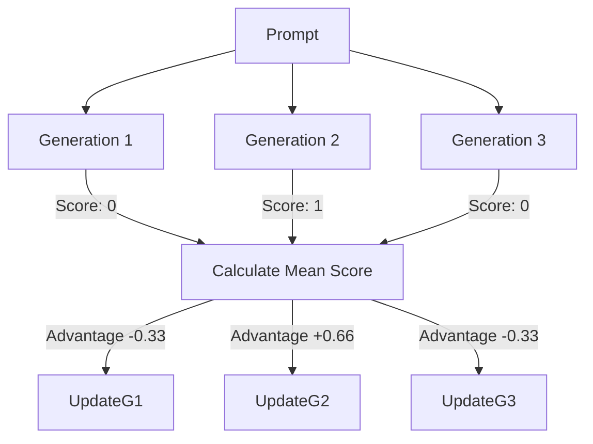

Supervised Fine-Tuning (SFT) teaches a model *how to speak*, but Reinforcement Learning (RL) teaches it *how to think and behave*.

In the modern post-training stack, selecting the right alignment algorithm is more critical—and confusing—than ever. Should you use the industry-standard PPO? The efficient DPO? Or newer techniques like ORPO and GRPO?

This guide breaks down the mathematical intuitions, architectural requirements, and practical pros/cons of the top RL techniques used in Agentic AI today.

---

## The Core Intuition: How RL Updates Weights

Before diving into specific algorithms, let's ground ourselves in the mechanics. Unlike SFT, where we have a "Gold Standard" target token, RL relies on a scalar **Reward**.

Think of the LLM as a puppy:
1. **Action:** The puppy sits (model generates a token).
2. **Reward:** You give a treat (+10).
3. **Update:** The neural pathways strengthening the "Sit" command are reinforced.

If the puppy bites the furniture:
1. **Action:** Bite furniture.
2. **Reward:** You say "No!" (-10).
3. **Update:** The gradient flips, weakening those neural pathways.

### The Math: Gradient Descent on Rewards

Mathematically, we maximize the **Expected Reward** $J(\theta)$ using the Policy Gradient.

$$\nabla J(\theta) = \mathbb{E} [ \underbrace{R(\tau)}_{\text{Score}} \cdot \underbrace{\nabla \log \pi_\theta(a|s)}_{\text{Direction}} ]$$

* **Direction ($\nabla \log \pi$):** This vector points in the direction that makes the generated action *more probable*.
* **Score ($R$):**
  * If $R$ is **Positive**, we push the weights in that direction (do it again).
  * If $R$ is **Negative**, we flip the gradient vector (don't do it again).

---

## 1. PPO (Proximal Policy Optimization)

*The "Conservative Teacher"*

PPO is the gold standard for RLHF (Reinforcement Learning from Human Feedback). It is an "online" method, meaning the model generates data, learns from it, and immediately discards it.

### The Architecture: The "4-Model" Problem

PPO is computationally heavy because it requires loading **four** separate models into memory (or using parameter-efficient approximations like LoRA):

1. **Actor ($\pi_{\theta}$):** The student (trainable). The LLM generating text.
2. **Reference Model ($\pi_{ref}$):** A frozen copy of the student. Used to calculate KL divergence (preventing the student from drifting too far).
3. **Reward Model ($R$):** The judge (frozen). Scores the response (e.g., +1.0).
4. **Critic / Value Model ($V$):** The tutor (trainable). Predicts the score based *only* on the prompt.

### The Math: Advantage and Clipping

We do not just use raw reward. We use Advantage ($A$):

$$A = R - V(s)$$

This tells us: "Did the model do better than expected?"
If the prompt is hard, getting a score of 5 might be great ($A = +2$).
If the prompt is easy, getting a score of 5 might be poor ($A = -2$).

To prevent the model from changing its "personality" too quickly after a single lucky guess, PPO uses clipping:

$$L = \min \left( \frac{\pi_{new}}{\pi_{old}} \cdot A, \; \text{clip}\left(\frac{\pi_{new}}{\pi_{old}}, 1-\epsilon, 1+\epsilon\right) \cdot A \right)$$

$\epsilon$ (epsilon): usually 0.2. This forces the update to stay within a trusted region.

**Pros:** Extremely stable; hard to "break" the model.
**Cons:** VRAM-heavy (4 models needed); slower training loop.

---

## 2. DPO (Direct Preference Optimization)

*The "Efficient Ranker"*

DPO revolutionized the field by removing the need for a separate reward model. It treats the language model itself as the reward model.

### The Architecture: The "2-Model" Setup

DPO is much lighter on memory. It only requires:

* **Policy Model ($\pi_{\theta}$):** The student (trainable).
* **Reference Model ($\pi_{ref}$):** The anchor (frozen).

### The Math: Implicit Rewards

DPO derives the reward from the ratio of probabilities between the policy and the reference.

$$Reward(x,y) \approx \log \frac{\pi_{\theta}(y|x)}{\pi_{ref}(y|x)}$$

We optimize the model to maximize the gap between the Chosen ($y_w$) and Rejected ($y_l$) responses:

$$Loss_{DPO} = - \log \sigma \left( \beta \cdot [ (\log \pi_\theta(y_w) - \log \pi_{ref}(y_w)) - (\log \pi_\theta(y_l) - \log \pi_{ref}(y_l)) ] \right)$$

We push the probability of Chosen up (relative to Ref).
We push the probability of Rejected down (relative to Ref).

**Pros:** Efficient (2 models); simpler implementation; fast convergence.
**Cons:** Prone to overfitting. If the dataset has noisy labels, DPO memorizes the noise quickly.

---

## 3. ORPO (Odds Ratio Preference Optimization)

*The "All-in-One"*

ORPO challenges the assumption that you need a reference model at all. It combines Supervised Fine-Tuning (SFT) and alignment into a single stage.

### The Architecture: The "1-Model" Setup

* **Policy Model ($\pi_{\theta}$):** The only model needed. It learns instruction following and preferences simultaneously.

### The Math: The Odds Ratio

ORPO adds a penalty term to standard SFT loss based on the odds ratio ($OR$):

$$OR = \frac{\text{Odds}(y_{chosen})}{\text{Odds}(y_{rejected})}$$

The loss function combines learning "how to speak" (SFT) with "what to choose" (odds):

$$Loss_{ORPO} = \underbrace{Loss_{SFT}}_{\text{Grammar/Facts}} + \lambda \cdot \underbrace{Loss_{Odds}}_{\text{Preference}}$$

Instead of using a reference model to anchor the weights (like DPO), ORPO uses the SFT loss itself as the anchor. It ensures the model speaks correct English (SFT) while simultaneously separating the probability of good vs. bad answers (odds).

**Pros:** No reference model needed (large VRAM savings); single-stage training.
**Cons:** Hyperparameter sensitivity ($\lambda$) can be tricky; relatively new method.

---

## 4. GRPO and RLVR

*The "Consensus Builder" and "Truth Seeker"*

GRPO (Group Relative Policy Optimization) and RLVR (RL with Verifiable Rewards) represent a shift away from "vibe-based" judging toward objective correctness.

### How They Work

Instead of using a learned critic (value model) to normalize scores, GRPO uses the group mean:

1. **Generate:** The model generates a group of outputs (e.g., $k=8$ solutions) for the same prompt.
2. **Score:** We verify them (run the code, check the math answer).
3. **Normalize:** We calculate the average score of the group.
4. Outputs better than the group average get a positive update.
5. Outputs worse than the group average get a negative update.

$$Advantage_i = \frac{R_i - \text{Mean}(R_{group})}{\text{StdDev}(R_{group})}$$

**Pros:** Removes the critic model (VRAM savings); explicitly rewards consistency.
**Cons:** Requires generating multiple samples per step (slower throughput).

---

## Summary Comparison

| Algorithm | Type | Models in VRAM | Key Math Mechanism | Best For... |
| :--- | :--- | :--- | :--- | :--- |
| PPO | Online | 4 | Clipping + Value Function | Safety, nuanced chat, subjective quality |
| DPO | Offline | 2 | Implicit Reward (Log Ratio) | General chatbots with ranking datasets |
| ORPO | Offline | 1 | Odds Ratio + SFT Loss | Training from base models (domain adapt) |
| GRPO | Online | 1-2 | Group Normalization | Math, reasoning, chain-of-thought |
| RLVR | Online | 1-2 | Verifiable Reward Checks | Code/math with ground-truth evaluators |

---

## Final Thoughts

The choice of algorithm depends on your compute budget and your data availability.

Have ground truth (code/math)? Use GRPO/RLVR.
Have preference pairs (A vs B)? Use DPO (or ORPO if memory is tight).
Need robust safety? Stick with PPO.
