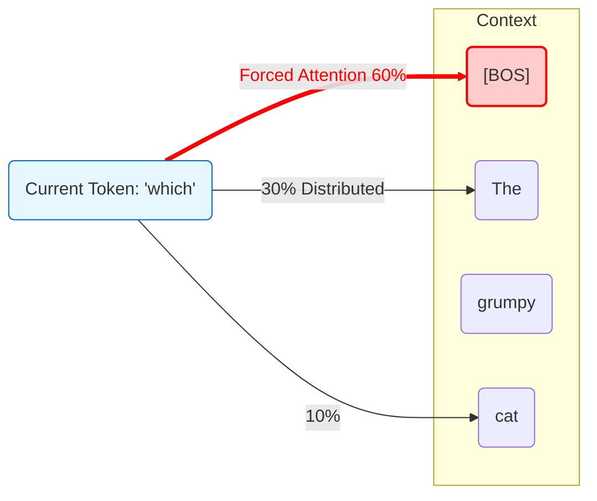
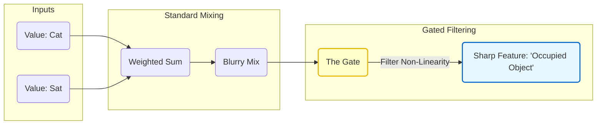

The Transformer architecture has dominated Natural Language Processing for nearly a decade. Its core engine, the **Attention Mechanism**, is famous for its ability to connect words across long distances. But as models have grown from millions to billions of parameters, researchers have discovered "glitches" in the matrix: subtle inefficiencies in how standard attention works.

In this post, we will deconstruct a recent breakthrough paper (NeurIPS 2025 Best Paper by the Qwen team): **Gated Attention**. We will explain it from first principles, visualizing the problems it solves: the **Attention Sink** and the **Linearity Bottleneck**, using step-by-step examples.

If you are familiar with how [Jay Alammar visualized Transformers](https://jalammar.github.io/illustrated-transformer/), you are in the right place.

---

## 1. The Status Quo: Standard Attention

Before we fix it, let's remember how it works. In a standard Transformer, every token (word) looks at every other token to decide what is important.

Mathematically, for a specific head, we compute:

$$
\text{Attention}(Q, K, V) = \text{Softmax}\left(\frac{QK^T}{\sqrt{d_k}}\right) V
$$

1. **Scores ($QK^T$):** How relevant is word A to word B?
2. **Softmax:** Turn those scores into probabilities (summing to 1.0).
3. **Weighted Sum ($V$):** Mix the information based on those probabilities.

This has served us well, but it forces two uncomfortable behaviors on the model.

---

## 2. The Problems

### Problem A: The "Attention Sink" (The Forced Spotlight)

Imagine attention is a spotlight. For every word the model processes, the Softmax function enforces a strict rule: **the spotlight must always be on (total intensity = 100%).**

**The Scenario:**
Consider the sentence:

> `[BOS] The grumpy cat sat on the mat, which was red.`

We are currently processing the word **"which"**.
"Which" is a functional connector. It does not really need to fetch deep meaning from "cat" or "mat" right this second. It essentially wants to say, *"I am just a comma with an attitude, ignore me."*

**The Glitch:**
The Softmax function *forces* the attention weights to sum to 1.0. The model effectively panics: *"I have nowhere useful to look, but I have to put this 100% attention somewhere!"*

So, it dumps the attention on the **Beginning of Sequence (`[BOS]`)** token (or the first token). This token becomes a "trash can" or an **Attention Sink**.



**Why is this bad?**
Over billions of training steps, the model learns to blast the first token with massive activation values just to satisfy the math. This creates spikes and instability, making the model harder to train and prone to crashing in long contexts.

### Problem B: The "Linearity Bottleneck" (The Paint Mixer)

Standard attention combines information linearly.

$$
\text{Output} = 0.7 \times V_{\text{cat}} + 0.3 \times V_{\text{sat}}
$$

**The Glitch:**
Think of this like mixing paint. You have a bucket of "Cat" information (Furry, Animal) and "Sat" information (Action). Standard attention just dumps them into a single bucket and stirs. You get a brownish average.

Because the aggregation is linear, the model struggles to perform sharp logic *within* the attention head, like: *"Keep the Cat features ONLY if the context is 'Pet', otherwise discard."* It lacks the tools to filter; it can only mix.

---

## 3. The Solution: Gated Attention

The Qwen team proposed a shockingly simple fix. They added a **Gate** (a dimmer switch) after the attention calculation.

### The New Math

$$
\begin{align}
\text{Standard Output} &= \text{Softmax}(QK^T)V \\
\text{Gate Value} &= \sigma(X W_{gate}) \\
\text{Final Output} &= \text{Gate Value} \odot \text{Standard Output}
\end{align}
$$

* **$\sigma$ (Sigmoid):** Squashes values between 0 and 1.
* **$\odot$:** Element-wise multiplication.

### How it Fixes the "Sink"

When the model processes a filler word like "which", the Gate looks at it and says: *"This is not useful."*
It sets the Gate Value to near **0**.
Even if the Softmax forces a 100% signal to the `[BOS]` token, the Gate multiplies it by 0. The trash is taken out. The spotlight turns off.

### How it Fixes the "Bottleneck"

The Gate adds **non-linearity**. It acts as a high-precision filter. Instead of just mixing paints, the model can now overlay a stencil, keeping exactly the features it wants and discarding the rest.

---

## 4. Visualizing the Difference

Let's walk through our example sentence again to see the difference in action.

**Sentence:** `[BOS] The grumpy cat sat on the mat`

### Example 1: The "Attention Sink" Fix

We are processing the word **"The"** (the second one). It does not need much context.

#### Standard Attention

The model is forced to attend to `[BOS]` to satisfy the sum-to-1 rule.

#### Gated Attention

The model calculates the attention, but the **Gate** intervenes.

```mermaid
graph TD
    subgraph step1["Step 1: Standard Attention"]
        Attn["Attention Mechanism"]
        BOS["[BOS]"]
        Cat["cat"]

        Attn -.->|High Score - Trash| BOS
        Attn -.->|Low Score| Cat

        OutStd["Standard Output vector"]
        Attn --> OutStd
    end

    subgraph step2["Step 2: The Gate"]
        Inp["Input: The"]
        GateCalc["Gate Calculation (Sigmoid)"]
        Inp --> GateCalc
        GateCalc -->|Result: 0.01 (CLOSE)| GateVal["Gate Value"]
    end

    subgraph step3["Step 3: Final"]
        OutStd --> Mult["x"]
        GateVal --> Mult
        Mult --> Final["Final Output ~ 0"]
    end

    style GateVal fill:#ffcccc,stroke:#cc0000
    style Final fill:#ccffcc,stroke:#00cc00
```

The vertical line (attention sink) on the attention map disappears because the gate simply mutes the head.

### Example 2: The "Linearity Bottleneck" Fix

Now we are processing **"mat"**. We want to understand the context of this mat (that a cat is on it).

#### Standard Attention

It mixes $V_{cat}$ and $V_{sat}$ together. It is a blurry mix of "Animal" and "Action".

#### Gated Attention

The Gate allows for **feature selection**. It can look at the "Cat" signal and decide to pass the "Furry" feature but block the "Meow" feature if it is not relevant to sitting on a mat.



---

## Summary

Gated Attention is a "why did we not think of this sooner?" moment. By adding a simple learnable gate, we decouple the probability distribution (Softmax) from the information magnitude.

| Feature | Standard Transformer | Gated Attention Transformer |
|:---|:---|:---|
| **Analogy** | Always-on Spotlight | Spotlight with a Dimmer Switch |
| **Idle Behavior** | Dumps attention on Token 0 (Sink) | Turns off the gate (Quiet) |
| **Mathematical Operation** | Linear Combination | Non-linear Gated Combination |
| **Performance** | Unstable at high learning rates | Very stable, cleaner loss curves |

This simple change allows models to be trained more stably and perform better, proving that sometimes the biggest leaps forward come from simply giving the model the ability to do nothing at all.
